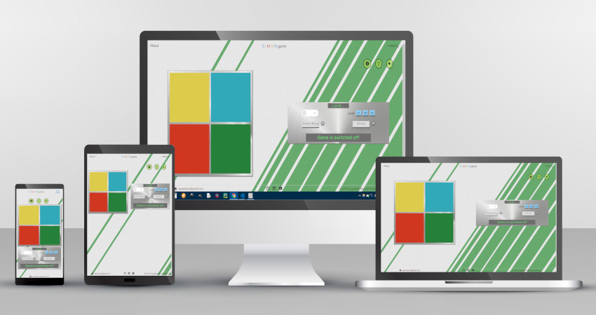

##### Second Milestone Project
# SIMON game

> A web version of Simon - single-player turn-based electronic memory game. It's a second milestone project for Code Institute's full stack developer course in which students need to show how to bring together elements of HTML, CSS and JavaScript and how to combine them to create interactive web applications.

## Table of Contents
1. [Team](#team)
1. [Ux](#ux)
   1. [Users stories](#users-stories)
   1. [Wireframes](#wireframes)
1. [Features](#features)
1. [Logic](#logic)
1. [Style and layout](#style-and-layout)
1. [Technologies used](#technologies-used)
1. [Project approach and difficulties](#project-approach-and-difficulties)
1. [Testing](#testing)
   1. [User stories](#user-stories)
   1. [Different browsers, mobile, desktop](#different-browsers-mobile-desktop)
1. [Deployment](#deployment)
1. [Content](#content)
1. [Acknowledgements](#acknowledgements)

## Team
- __Author__ - Mariusz Pawlowicz
- __Mentor__ - Antonija Šimić

## UX
The aim is to  build a web version of simple single-player game - Simon. 
The site should be a Single-Page Application, as responsive as possible.
Target audience of the website are people who like playing games casually or as their chosen medium of entertainment. To amuse them, this web-game is going to offer, among other things, easy rules, nice animation of colourful pads and pleasant to hear sounds.

#### Users Stories:
1. As a person who is visiting the website, I want to read about the game, to understand the rules.
2. As a person who is visiting the website, I want to read about the history of the game, to fill out my curiosity.
3. As a player, I need help in understanding options and functionality of the buttons and links on the website.
4. As a player, I want to watch how the game is lighting coloured pads and playing sounds, then I want to attempt to match the game's pattern by pressing pads in proper sequence.
5. As a player, I want be able to switch on and off the game.
6. As a player, I want be able to stop/reset the game.
7. As a player, I want to choose difficulty of the game, by setting up numbers of levels.
8. As a player, I want be able to see my progress in game, by checking current level on the screen.
9. As a player, I want to see the game displaying messages on the screen, informing me about my play.
10. As a player, I want to hear sounds when I click buttons on the website.
11. As a player, I want to see message and hear sound, if I win.
12. As a player, I want to see message and hear sound, if I lose.
13. As a player, I want to see message and hear sound, if I make mistake.
14. As a player, I want be able to choose strict mode.
15. As a player, I want to mute sounds of the game, to play in silence.
16. As a player, I want be able to change the look of the game to dark mode, to reduce eye strain.

#### Wireframes
1. [Main page](https://github.com/mariusz79/Second-Milestone-Project-Simon-Game/blob/master/assets/images/wireframe.png)

## Features
- Game panel with animated pads 
    - allows user to watch the game animating pads, then allows user to click the pads
- Game console 
    - allows user to operate the game, by using On/Off, Start/Stop, Levels, Strict Buttons situated on the console
- Turn On/Off the game
    - allows user to turn on/off the game. 
    - When turned on:
        - player sees the intro - pads are flashing one by one
        - player hears the sound of the game being turned on
        - grey led lights next to 'Start/Stop' and 'Strict' buttons become red
        - medium level button gets darker color than the others
        - functionality of the all buttons on the console become enabled
    - When turned off:
        - player hears the sound of the game being turned off
        - led lights next to 'Start/Stop' and 'Strict' buttons become grey
        - all level buttons get the same color
        - functionality of the all buttons on the console become disabled
- Start/Stop playing-
    - allows user to start/reset the play; 
- Choose number of levels 
    - allows user to choose one of the three predefined difficulty levels, by clicking on 'Levels' buttons. Clicking on level buttons during the play will reset the game
- Strict mode
    - allows user to choose strict mode, by clicking on 'Strict' button. Clicking on 'Strict' button during the play would not reset the play. Strict mode means that player is losing in case of making mistake.
- Display current level 
    - allows user to check his progress in the game, by checking current level displaying on the small screen at the top of the console
- Display messages for user
    - allows user to see messages displaying for him on the bigger screen at the bottom of the console
- Display help 
    - allows user to see help modal, by clicking on 'Info' icon
- Day/Night mode 
    - allows user to switch between light and dark mode, by clicking on 'Day/Night mode' icon
- Turn Sound on/off 
    - allows user to mute/unmute sounds, by clicking on 'Sound on/off' icon
- Animation
    - pads on the game panel have background color animated; this makes impression of flashing lights
- Sounds
    - allows user to hear different sounds generated by the game:
        - four different sounds assigned to each pad; playing when the game is animating pads or player is clicking pads
        - sounds assigned to the switch and buttons on console and 'options' icons; playing on click
        - 'error', 'lose' and 'win' sounds playing when player is making mistake, losing or winnig
- Led lights
    - situated next to the 'Start/Stop' and 'Strict' buttons on the console
    - grey color means functionality of the buttons is disabled
    - red color means functionality of the buttons is enabled
    - green color means functionality of the buttons is being used
- Navbar
    - contains logo, About and History links
- Footer 
    - contains linked social icons and contact email

## Logic
The logic of the game is contained in the script named game.js.

Simon is a turn-based game. In games's turn Simon lights coloured pads and play sounds, in user's turn player tries to match Simon's pattern by pressing the pads in the proper sequence. In this project, game's and player's turns are represented accordingly by the two main fuctions, cpuTurn() and playerTurn().

There are few variables connected with the cpuTurn() function. Their descriptions will help with understanding the function.
- var cpuPattern - an array that stores randomly generated numbers in range from 1 to 4 inclusive
- var delay  - contains a specified number of milliseconds, used within setTimeout() method
- var timersIds - setTimeout() method returns a number representing the ID value of the timer that is set. TimersIds is an array that stores IDs of setTimeout's methods that later will be used to cancel the execution of setTimeout's
- var currentLevel - representing current level during the play
- var numOfLevels - numbers of levels player has to beat to win the game

How the cpuTurn() function works?
    It uses 'for' loop to go through the cpuPattern and calls specified functions for every element in the pattern. Called functions animate specified pads and play sounds. 
    The setTimeout() method is used to prevent the game from calling all 'animations and sound' functions in the same time. It calls functions after  time set out in var delay multiplied by index of element in the cpuPattern (in JavaScript first element has index number 0, second has index number 1, etc.). That means animation for first element is called immediately (0 multiplied by number defined in var delay), animation for second element is called after time defined in var delay(1 multiplied by number defined in var delay), etc..
    At the end cpuTurn() calls playerTurn() function. How computer knows when to call playerTurn()?
    The setTimeout() method comes with help again. Player's turn is called after time set out in var delay multiplied by the number contained in var currentLevel(which is corresponding with number of elements in the cpuPattern).
When cpuTurn() is working, current level is displaying on the small screen at the top of the console and message 'cpu turn' is displaying on the bigger screen at the bottom of the console.

PlayerTurn() function is waiting for and listening to player's clicks. It's using following variables:
- usedPattern, which is shallow copy of cpuPattern(created by slice() method); that means the original array wil be not modified
- strictMode - if it's value is set up to 'true' player is losing game in case of making mistake
- item - it's an element taken (by using shift() method) from the beginning of the usedPattern on every user's click. Item is no more in the usedPattern array
- padId - equals id(Html attribute) of a pad(by using 'this' keyword) that has been clicked

How the playerTurn() function works?
    Every time player clicks the pad, the function compares 'item' with 'padId'. 
    If they are identical, 'animation and sound' function is called for the clicked pad. The playerTurn() is listening for clicks till last element from usedPattern is gone. In that situation, function checks if var currentLevel equals var numOfLevels(in other words - if player hit the chosen level). If no, cpuTurn() function is called and play continues. If yes, player sees 'You win' modal and the play ends.
    If 'item' and 'padId' are not identical, game checks value of variable 'strictMode'. 'False' means that player only hears 'error' tone and can continue the game. 'True' means that player is losing and has to start new game from the begining with newly generated pattern.
    When playerTurn() function ends, 'onclick' event gets unbind from the pads, what means that clicking on the pads would not cause any effect.
When playerTurn() is working, current level is displaying on the small screen at the top of the console and message 'player turn' is displaying on the bigger screen at the bottom of the console.

There is more functions and event handlers in the script. Some of them are directly connected with the two main fuctions, for example:
- function addNumToCpuPattern() - add randomly generated integer in range from 1 to 4 inclusive to the cpuPattern
- function stopSetTimeouts - stops execution of setTimeout's, whose ID's are stored in timersIds array

Others are not responsible for core play, but still add value to player's experience. They play sounds when buttons are being clicked, change color of the led lights, allows player to mute the game, etc..

## Style and layout
- __Overall Style__ -
The site should be a Single-Page Application (SPA).
The site should be as responsive as possible.
Whenever possible, I should strive to use semantic HTML5 elements to structure  HTML code better.

- __Navigation__ - 
The site should incorporate links or buttons to allow  user to navigate the site and reset/control the site functionality.

## Technologies Used
- [HTML5](https://www.w3.org/TR/html52/)
    - to create website
- [CSS3](https://www.w3.org/Style/CSS/Overview.en.html)
    - to style all elements of the website
- [Bootstrap framework v4.1.3](http://getbootstrap.com/)
    - used for responsiveness
- [JavaScript](https://developer.mozilla.org/bm/docs/Web/JavaScript)
    - used for DOM manipulation
- [jQuery](https://jquery.com/) v3.3.1
    - used to simplify DOM manipulation
- [jQueryUI](https://jqueryui.com/) v1.12.1
    - used for color animation
- [Font Awesome](https://fontawesome.com/) v5.5.0
    - for all icons used on website
- [Google fonts](https://fonts.google.com/)
    - for extra fonts used on website
- [Gimp](https://www.gimp.org/)
    - for changing resolution and cutting images, making help image
- [Chrome developer tools](https://developers.google.com/web/tools/chrome-devtools/)
    - for editing page on-the-fly, diagnosing problems
- [Visual Studio Code](https://code.visualstudio.com/)
    - code editor
- [Git & GitHub](https://github.com/)
    - for project's version control and deployment
- [tinypng.com](https://tinypng.com/) 
    - for images compression
- [audiotrimmer.com](https://audiotrimmer.com/) 
    - for cutting audio files
- [Pencil v3.0.4](https://pencil.evolus.vn)
    - for wireframes
- [The W3C Markup Validation Service](https://validator.w3.org/nu/)
    - to check for syntax errors in HTML code
- [The W3C CSS Validation Service](https://jigsaw.w3.org/css-validator/)
    - to check for errors in CSS code

## Project approach and difficulties.
#### Style
After chosing the project, I familiarized myself with info from links delivered by Code Institue, then I did my own research as well. 
After that I knew that my project will need a game panel - a place with coloured pads, and a console - a place with grouped buttons, that could be used to operate the game.

I wanted to make game panel circular, with circular pads but I had problem with responsiveness as it did't scale nicely and decided eventually to use grid instead.
I planned initially to situate the console straight below the game panel but then I discovered that users having large screens would have to scroll the content continuosly to play the game. That's why the console is on bigger screens on the right side of the game panel.

For pads animation I used first jquery's fade in, fade out methods to make impressions od lighting pads. The results were not great and I decided to use jquery ui and it's animation method to animate the colors of the pads.

I kept the navbar and the footer relativelly small, also font and icons on navbar and footer look dim so users could focus easily on gameplay only. Simon's logo however gets colorized to stand out from the rest of the links.

I tried to give the website a bit of industrial look. I used minimalistic wallpaper, metallic background for game panel and console, squared fonts, also decided not to round corners of buttons, console and pads so they could stay sharp.

I used an jpg image to display help, I encounterd problem with responsiveness of the image so I had to use few media queries to change the size of that jpg.
On smaller sreens I had to move options icons up, so more content could be visible for the user.

#### Logic
First I created function that adds random integers to array. Then cpu had to go through the array and call animation for each element in the array. First problem was that all animations were called at the same time. I had to learn how to use setTimeout method to make a delay between calls. Next difficult thing was calling playerTurn function after cpu went through entire cpuPattern. I made experiments with callback function, but it didn't work well and I decided to use setTimeout method again.

When it comes to playerTurn function, I was trying few ways to check if player clicks correct pad. Eventually I choose a method where game takes first element from it's own pattern and compares it with ID of the pad clicked by user. 

After core game code was working, I started to build functions and use event handlers responsible for turning the game on and off, starting gameplay, display messages etc.

At the end of the work there was a problem with pads' sounds. When pad were pressed fast, only sound of one click was played. I had to use currentTime = 0 method to rewind the sound everytime user click a pad.

## Testing
#### User stories
User stories from the UX section were tested to ensure that they all work as intended, with the project providing an easy and straightforward way for the users to achieve their goals.
1. As a person who is visiting the website, I want to read about the game, to understand the rules.
> - Click the 'About' link situated in navbar. For browser's width less than 576px click menu('hamburger' icon) and then click 'About'.
2. As a person who is visiting the website, I want to read about the history of the game, to fill my curiosity.
> - Click the 'History' link situated in navbar. For browser's width less than 576px click menu('hamburger' icon) and then click 'History'.
3. As a player, I need help in understanding options and functionality of the buttons and links on the website.
> - Click 'Help' icon situated between navbar and game panel.
4. As a player, I want to watch how the game is lighting coloured pads and playing sounds, then I want to attempt to match the game's pattern by pressing pads in proper sequence.
> - Click Start/Stop button on the console when game is switched on.
5. As a player, I want be able to switch on and off the game.
> - Click switch ON/OFF button.
6. As a player, I want be able to stop/reset the game.
> - CLick Start/Stop button during the play.
7. As a player, I want to choose difficulty of the game, by setting up numbers of levels.
> - Click one of the three level buttons on the console.
8. As a player, I want be able to see my progress in game, by checking current level on the screen.
> - Check current level on the top screen on console.
9. As a player, I want to see the game displaying messages on the screen, informing me about my play.
> -Check messages displaying at the bottom screen on console.
10. As a player, I want to hear sounds when I click buttons on the website.
> - Buttons have sounds assigned to them. Sounds will play on click.
11. As a player, I want to see message and hear sound, if I win.
> - Game shows 'You Win!' modal and plays 'win' sound if player wins.
12. As a player, I want to see message and hear sound, if I lose.
> - Game displays 'You Lose' message on the bottom screen on console and plays 'lose' sound if player lose.
13. As a player, I want to see message and hear sound, if I make mistake.
> - Game displays 'Wrong Button' message on the bottom screen on console and plays 'error' sound if player makes mistake.
14. As a player, I want be able to choose strict mode.
> - Click 'Strict' button  on console.
15. As a player, I want to mute sounds of the game, to play in silence.
> - Click 'Sound on/off' icon situated between navbar and game panel.
16. As a player, I want be able to change the look of the game to dark mode, to reduce eye strain.
> - Click 'Day/Night Mode' icon situated between navbar and game panel.

#### Different browsers, mobile, desktop.
According to https://www.w3schools.com/browsers/ statistics, the most popular browsers are:
- Chrome;
- Edge/IE,
- Firefox,
- Opera.

This project website was tested on mentioned above web browsers, desktop/mobile, Android and iOS.
The project looks and works properly on different browsers and screen sizes. The exception is Internet Explorer, which has problems with supporting grid system and Bootstrap, on IE v9 game was unplayable.
 
When the website is loaded for the first time, there is a small delay the first time a sound(of button or pad) is played. Next clicks on pads and buttons don't bring any delay. Only in Firefox sounds are playing sometimes after delay, even after long gameplay.

In Opera 'Start/Stop' and 'Strict' buttons gets blue color on hover.

#### Code validation
HTML and Css code for this website were validated using W3C Validation Service. No errros were found in the code.

## Deployment
This site has been deployed on GitHub pages and can be viewed here: [live preview of project](https://mariusz79.github.io/Second-Milestone-Project-Simon-Game/) 

## Content
#### Images
All images used in the project were downloaded from [pixabay](https://pixabay.com/).
Mockup image was made using vector graphic created by starline from [freepik.com](https://www.freepik.com/free-vector/different-devices-mockup_1075504.htm)
#### Audio
All sounds used in the game were downloaded from [freesound.org](https://freesound.org/).

## Acknowledgements
I received inspiration for this project from [Code Institute](https://www.codeinstitute.net/).